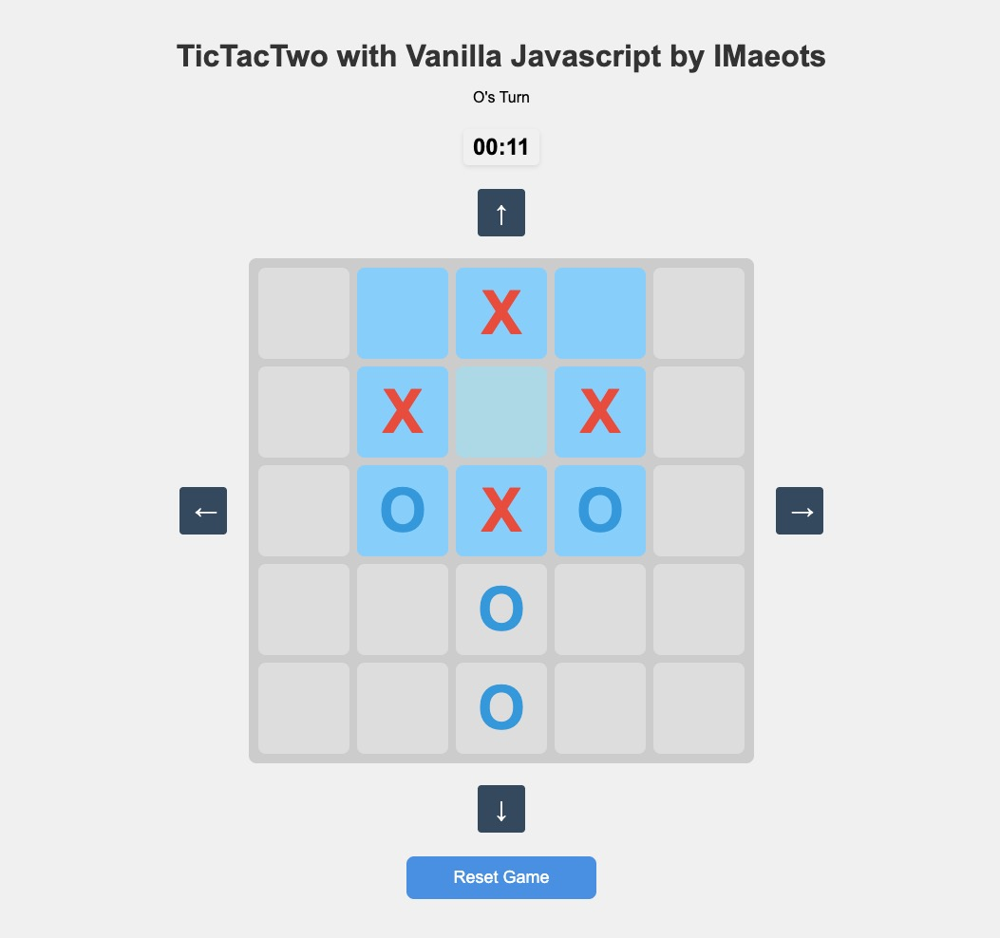
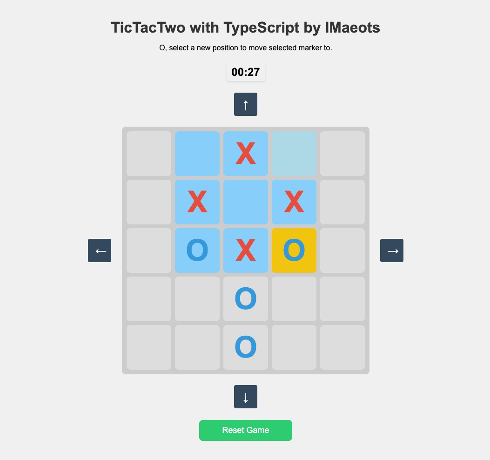
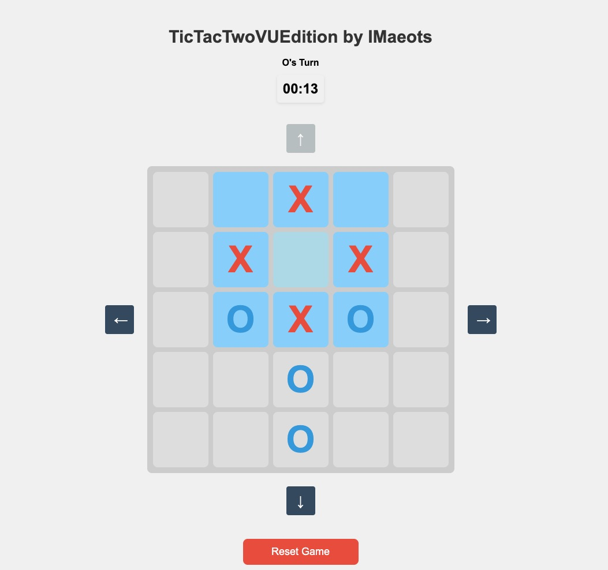

# TicTacTwoWeb - Multi-Tech Stack Collection

A collection of **Tic-Tac-Toe** game implementations across different technologies: **Vanilla JavaScript**, **TypeScript**, and **Vue.js**. This repo contains 3 different versions of the TicTacTwo game, each with the same core gameplay, but built using a different approach.
This repository includes 3 of the total 7 TicTacTwo games developed for Uni 2024-2025.

Each folder contains its own `README.md` to explain the specific implementation details of that version.

---

### 🚀 Game Overview

TicTacTwo is a creative twist on the classic **Tic-Tac-Toe** game. The game is played on a **5×5 grid**, with only a **3×3 section active at any time**. As the game progresses, players can move their markers or even shift the active section of the grid. You can play **locally** with a friend or against the **AI**.

---

## Folder Structure

1. **TicTacTwo** - Vanilla JavaScript
   - Location: `/TicTacTwo`
   - A **pure vanilla JavaScript** implementation of the game, using HTML and CSS. One out of seven variations written for university coursework (2024-2025).

2. **TicTacTwoTS** - TypeScript
   - Location: `/TicTacTwoTS`
   - A **TypeScript**-based version of the game, improving on type safety and leveraging modern JavaScript features.

3. **TicTacTwoVUE** - Vue.js
   - Location: `/TicTacTwoVUE`
   - A **Vue.js** implementation, utilizing the power of Vue's component-based architecture to organize the game's features.

---

### 🎮 Game Description

TicTacTwo is an advanced version of **Tic-Tac-Toe** with a unique twist:

- The game is played on a **5×5 grid**, but only a **3×3 section** is active at any time.
- After 6 total moves, players can either place new markers or move existing ones.
- Players can also **shift the active playing area** after 6 total moves.
- Each player has a maximum of 6 markers in total.
- You can play **locally** with a friend or against the **AI**.

---

### Features

- **Two Game Modes:**
  - Play against a friend locally.
  - Play against the AI.
  
- **Dynamic Gameplay:**
  - Place markers in the first phase.
  - Move your markers or shift the active 3×3 grid in the second phase.
  
- **Time Tracking**: Track the duration of your games.
- **Responsive Design**: Play on any device.

---

### 🚀 Getting Started

#### Prerequisites

- Any modern web browser (Chrome, Firefox, Safari, or Edge).

#### 🌟  To Run Them Without Installation

- These are all easily accessible via this link: https://enos.itcollege.ee/~inmaeo/ (at least in 2025)
- There, you have options for all 3 versions of the same TicTacTwo game - select one of the folders and play!

#### Installation

Clone this repository:

```bash
git clone https://github.com/IMaeots/TicTacTwoWeb.git
cd TicTacTwoWeb
```

## Screenshots
All look very similar in UI:




## 📝 License

All Rights Reserved

## Author

Name: Indrek Mäeots
School email: inmaeo@taltech.ee

Disclaimer: of course it is not perfect
